# Skin Lesion Classification: ML vs Deep Learning

**University of Texas at Arlington — Division of Data Science**  
**Sidhantaa Sarna | Tiffany De La Cruz | Diego Maldonado**  
**Course: DATA 4382 — Senior Capstone**

---

## Business Problem / Motivation

Skin cancer is one of the most common cancers worldwide. Early and accurate detection can significantly improve patient outcomes and save lives. Dermatologists use visual inspection of skin lesions to identify potentially dangerous growths — but this process is time-consuming, subjective, and not always accessible.

Most AI approaches default to deep learning, which can be a black box and often struggles when data is limited or imbalanced. This project explores whether traditional machine learning models, built with clinically inspired features, can match or outperform deep learning in this real-world, data-constrained setting.

---

## Project Overview

This project compares classical machine learning models **(XGBoost and Random Forest)** against a deep learning baseline **(ResNet50)** for multi-class skin lesion classification using dermoscopic images.

Rather than feeding raw images into a neural network, we converted images into **140+ numerical features** capturing color, texture, shape, and edge patterns — inspired by the clinical **ABCD method** (Asymmetry, Border, Color, Diameter) used by dermatologists.

### Key Results

| Model | Accuracy | Macro F1-Score |
|---|---|---|
| ResNet50 (Deep Learning) | 55% | 0.45 |
| Random Forest | 60% | 0.49 |
| **XGBoost** | **60%** | **0.50** |

> XGBoost and Random Forest both outperformed the deep learning baseline.

---

## Data

- **Source:** [ISIC Archive — International Skin Imaging Collaboration](https://www.isic-archive.com)
- **Type:** Dermoscopic JPG images with metadata CSV
- **Size:** 2,357 images across 9 skin lesion classes
- **Classes:** Pigmented Benign Keratosis, Melanoma, Basal Cell Carcinoma, Nevus, Squamous Cell Carcinoma, Vascular Lesion, Actinic Keratosis, Dermatofibroma, Seborrheic Keratosis

> Full image dataset not included due to size. Download directly from the [ISIC Archive](https://www.isic-archive.com).

---

## Data Preprocessing

### Deep Learning (ResNet50)
- Removed hair follicles using morphological filtering
- Resized and normalized pixel values to [0, 1]

### Machine Learning (XGBoost & Random Forest)
Converted each image into **140+ numerical features:**

| Feature Type | Examples |
|---|---|
| Color | Mean & std across RGB and HSV channels |
| Texture | Contrast, correlation, energy, homogeneity |
| Shape | Area, perimeter, radius, diameter, asymmetry |
| Edge | Edge density and gradient magnitude |

- Applied **SMOTE** and **SMOTETomek** to handle class imbalance

---

## Exploratory Data Analysis

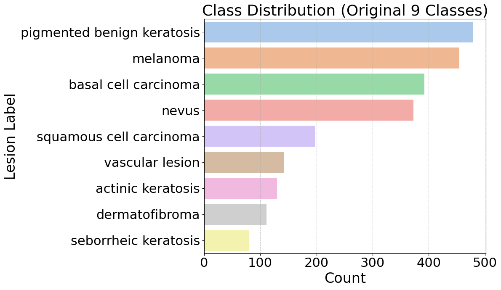

- **Class Imbalance:** Pigmented benign keratosis and melanoma dominate; dermatofibroma and vascular lesion have very few samples
- **Color Distributions:** RGB channel analysis revealed distinct intensity patterns across lesion types

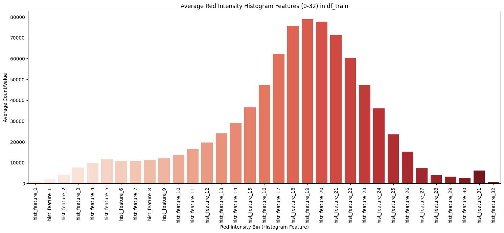
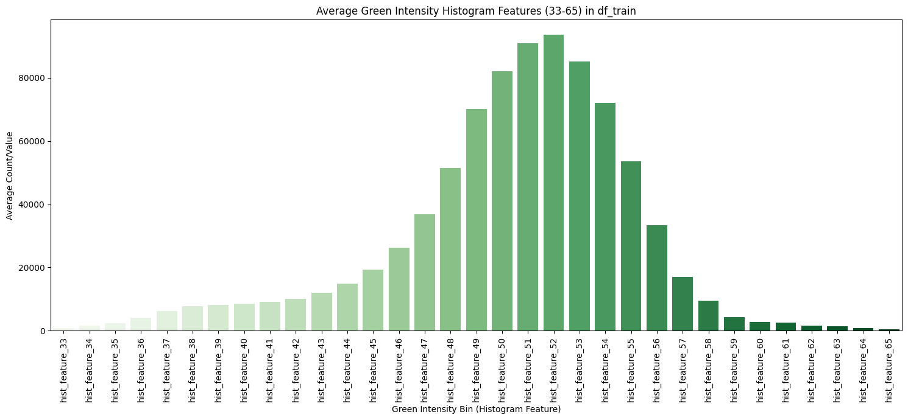
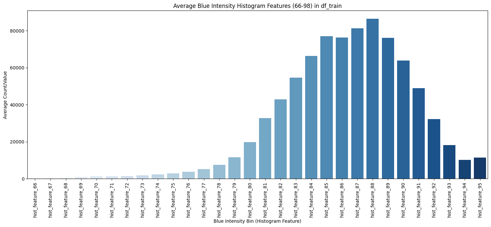

- **Feature Distributions:** Shape and size features showed the most variation across classes

---

## Modeling Approach

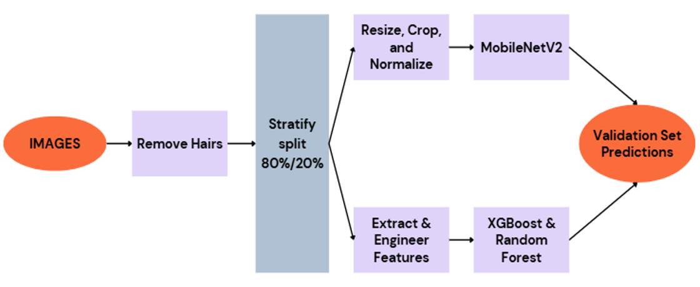

### Baseline — ResNet50 (Deep Learning)
A convolutional neural network pre-trained on ImageNet, fine-tuned on our ISIC dataset. Learns directly from raw image pixels.

### Advanced Models — XGBoost & Random Forest
Both trained on 140+ engineered tabular features.

- **XGBoost:** Chosen for strong tabular performance, regularization, and handling class imbalance
- **Random Forest:** Chosen as an ensemble comparison with interpretable feature importance

> The key distinction: instead of letting a neural network learn features on its own, we explicitly engineered features grounded in **clinical knowledge** — making models more interpretable and trustworthy.

---

## Model Training

**Tools:** Python 3.11, scikit-learn, XGBoost, imbalanced-learn, OpenCV, TensorFlow/Keras, SHAP, pandas, numpy, matplotlib, seaborn

| Model | Tuning Method | Balancing |
|---|---|---|
| XGBoost | RandomizedSearchCV | SMOTETomek |
| Random Forest | RandomizedSearchCV | SMOTE |
| ResNet50 | Transfer learning, Adam optimizer | Class weights |

---

## Results

### Metrics Used
- **Accuracy:** Standard benchmark for overall correctness
- **Macro F1-Score:** Chosen due to class imbalance — treats all classes equally regardless of size

### Model Comparison

| Model | Accuracy | Macro F1-Score |
|---|---|---|
| ResNet50 | 55% | 0.45 |
| Random Forest | 60% | 0.49 |
| **XGBoost** | **60%** | **0.50** |

### XGBoost Results
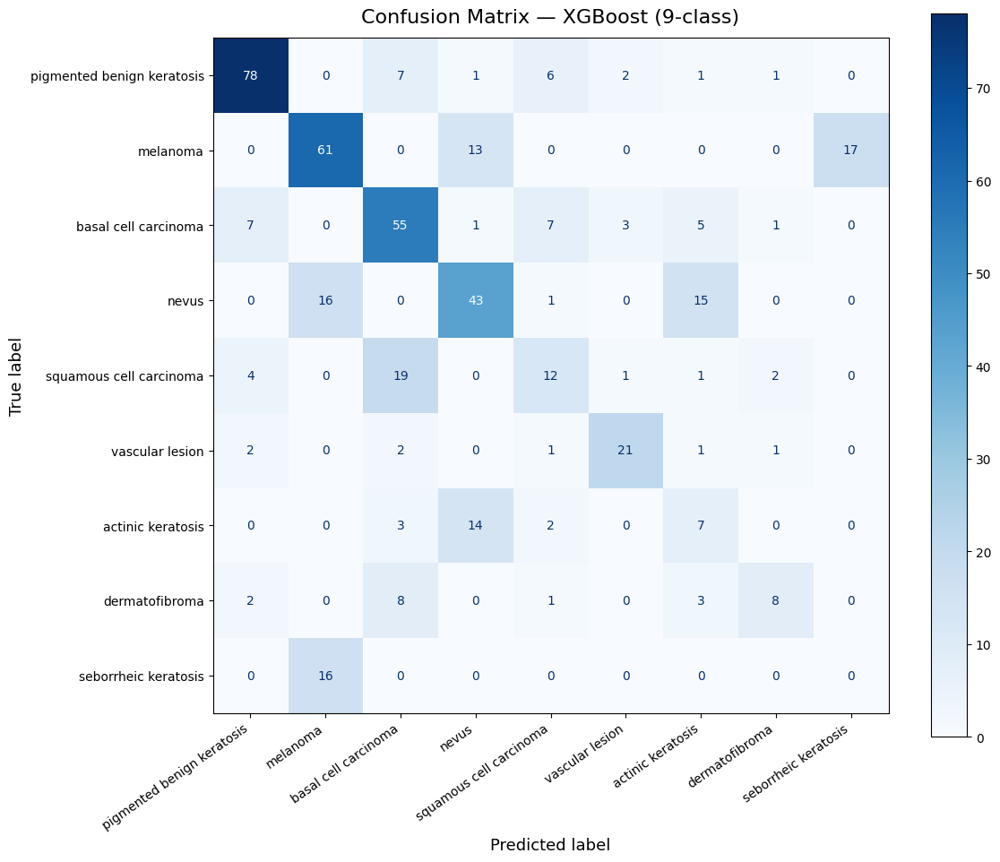
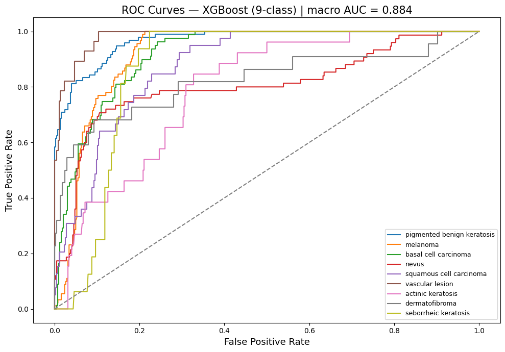

### Random Forest Results
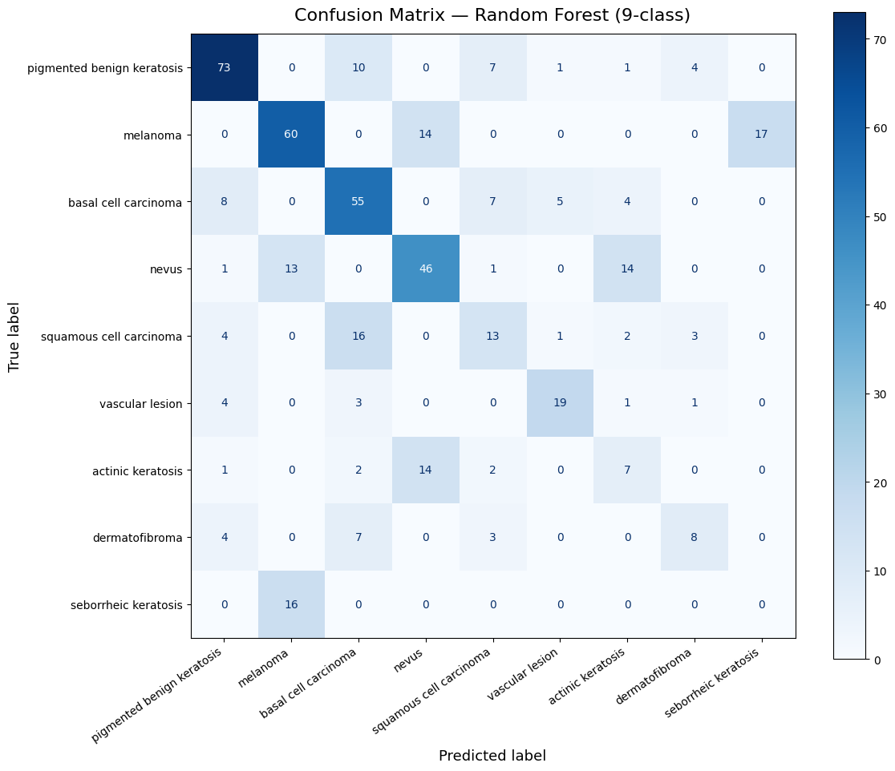
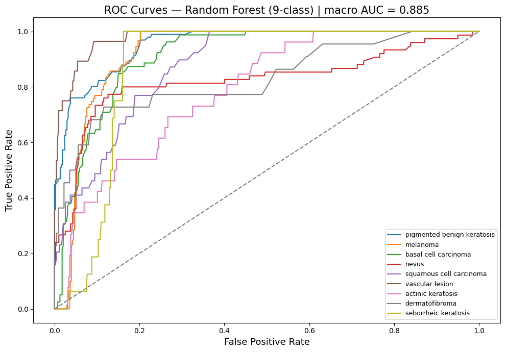

---

## Model Interpretation

### SHAP Values — XGBoost
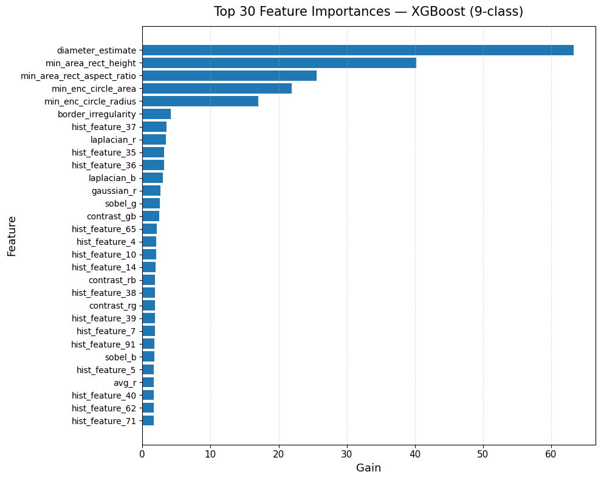
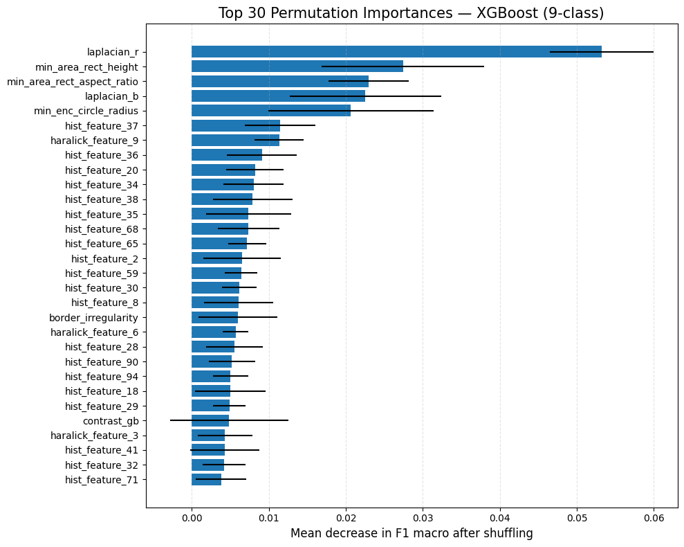

### SHAP Values — Random Forest
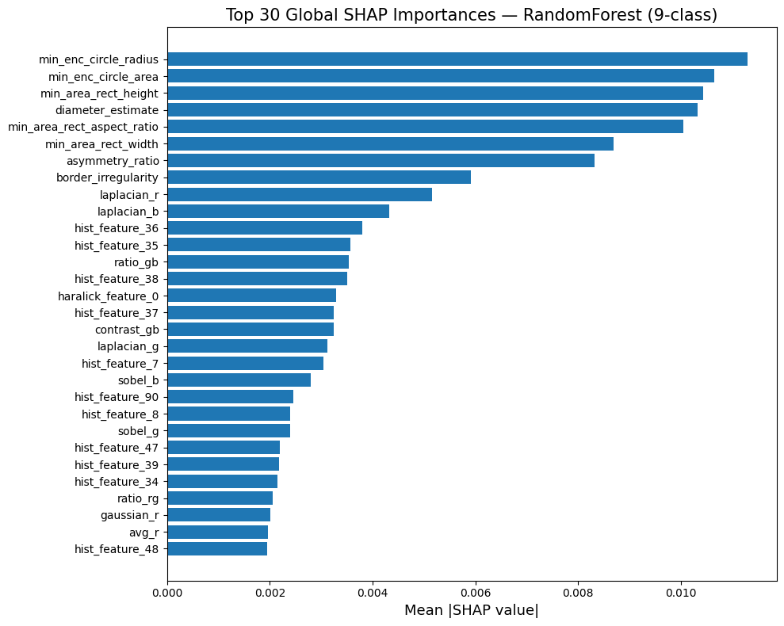
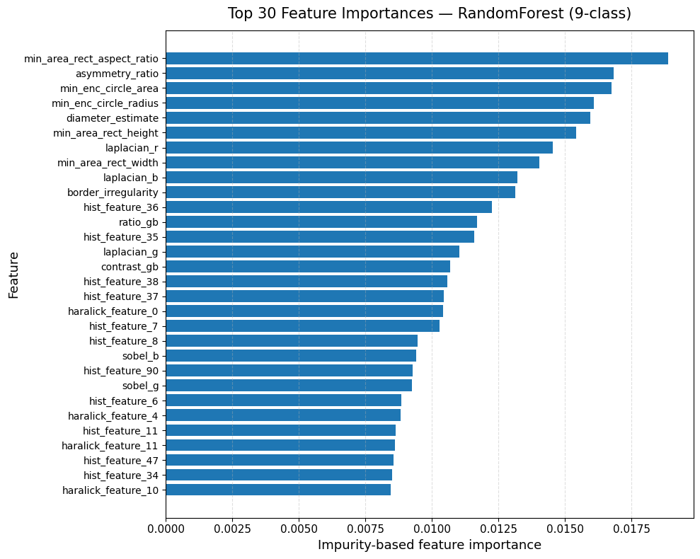
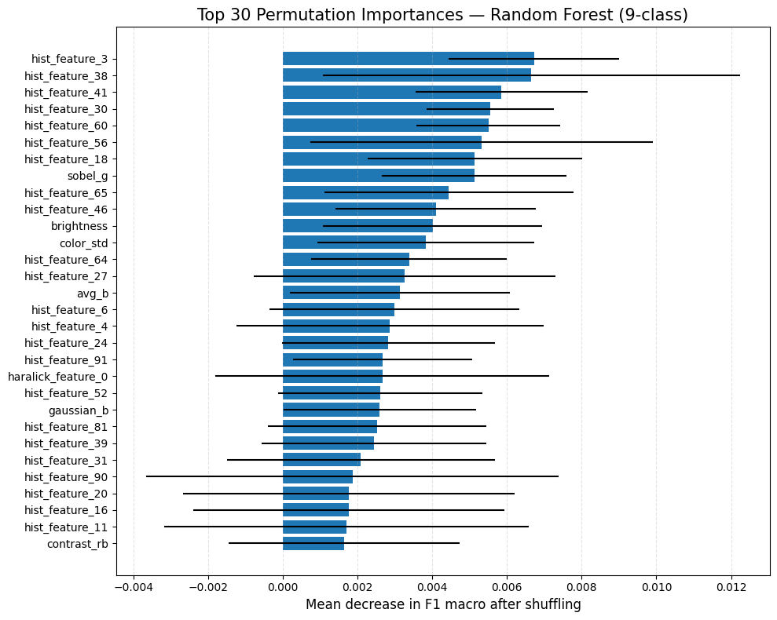

Most influential features:
- **Radius, area, diameter** — size-related shape features
- **Texture features** — capturing surface irregularity
- **Color channel statistics** — mean and variance across RGB channels

These align directly with the **clinical ABCD criteria** dermatologists use in practice.

### Grad-CAM & LIME (ResNet50)
Used to visualize which image regions drove predictions and highlight influential superpixels.

---

## Key Insights

- **Machine learning outperformed deep learning** — 60% vs 55% accuracy
- **Class imbalance was the primary bottleneck** — no balancing technique fully resolved it
- **Data availability matters more than model complexity**
- **Interpretable models build clinical trust** — features map directly to what doctors already use
- **Business Impact:** An interpretable skin lesion classifier could assist dermatologists in triaging cases and improving early detection access in underserved areas

---

## Conclusion

Classical machine learning models with well-engineered, clinically grounded features outperformed deep learning on this limited, imbalanced dataset. More complex technology is not always better — in medical AI, **interpretability and trust matter just as much as raw performance.**

---

## Future Work

- Add texture features for finer-grained detail
- Explore more advanced model architectures
- Address class imbalance through data augmentation
- Deploy best model as a real-time web application
- Test on external skin lesion datasets

---

## How to Run

```bash
# 1. Clone the repo
git clone https://github.com/Sidhantaa/skin-lesion-classifier.git
cd skin-lesion-classifier

# 2. Install dependencies
pip install -r requirements.txt

# 3. Download dataset from https://www.isic-archive.com and place in data/

# 4. Run feature extraction
jupyter notebook "notebooks/feature extraction/Image to Tabular Pipeline.ipynb"

# 5. Train XGBoost
jupyter notebook "notebooks/xg boost/xgBoost_final.ipynb"

# 6. Train Random Forest
jupyter notebook "notebooks/random forest/RF_9_classes.ipynb"

# 7. Run CNN
jupyter notebook "notebooks/CNN/EDA.ipynb"
```

---

## Repository Structure

```
skin-lesion-classifier/
├── README.md
├── requirements.txt
├── data/
│   ├── SC_Dataset_9_Classes.csv
│   └── sample_images/
├── notebooks/
│   ├── xg boost/
│   │   ├── xgBoost_final.ipynb
│   │   └── xgb_results_3_classes.ipynb
│   ├── random forest/
│   │   ├── RF_9_classes.ipynb
│   │   └── Baseline_Models_9_Classes.ipynb
│   ├── feature extraction/
│   │   └── Image to Tabular Pipeline.ipynb
│   └── CNN/
│       ├── EDA.ipynb
│       ├── download_data.py
│       └── preprocess.py
├── models/
│   ├── xgb_best_model.pkl
│   ├── rf_9_classes_model.pkl
│   └── resnet50.keras
├── results/
└── images/
    ├── class_distribution.png
    ├── modeling_pipeline.png
    ├── red_intensity.png
    ├── green_intensity.png
    ├── blue_intensity.png
    ├── RF/
    │   ├── rf_confusion_matrix.png
    │   ├── rf_roc_curves.png
    │   ├── rf_global_shap.png
    │   ├── rf_top30_features.png
    │   └── rf_permutation_importances.png
    └── XGB/
        ├── xgb_confusion_matrix.png
        ├── xgb_roc_curve.png
        ├── xgb_top30_features.png
        └── xgb_permutation_importance.png
```

---

## Requirements

```bash
pip install -r requirements.txt
```

**Key libraries:** `xgboost`, `scikit-learn`, `imbalanced-learn`, `opencv-python`, `tensorflow`, `keras`, `shap`, `pandas`, `numpy`, `matplotlib`, `seaborn`, `jupyter`

---

*For questions or collaboration, feel free to reach out via GitHub.*
